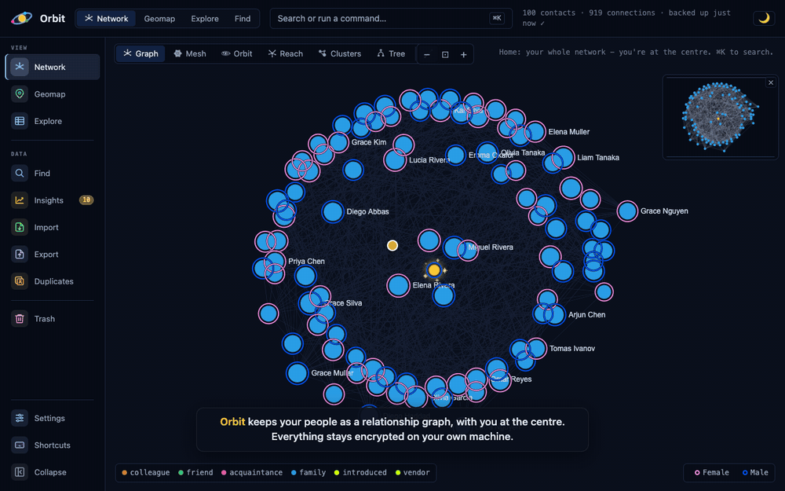

# Orbit

Your people as a relationship graph, with you at the centre. Orbit is a
personal CRM that stays on your machine: one encrypted file, a small Node
service that runs at login, and a web page in your own browser as the UI.
Search that forgives typos, six ways to draw the same network, a family tree,
a world map, an import wizard that checks for duplicates, and a bookmark that
adds the person on any web page you are looking at.

No app is installed, nothing is compiled and nothing sits in your menu bar. The
database is SQLCipher-encrypted, its key lives in your OS keychain, and the only
thing that ever leaves the machine is an optional map tile.

## Walkthrough



Four minutes with captions: the graph with legend filters and fade links, the
search palette and its operators, a person's card with Add connection and 2
hops, the six views (switching Orbit's rings, expanding the Tree), zooming the
Geomap, Explore with facets, sorting and edit mode, a Find query, Insights, the
import wizard, the Add to Orbit bookmark, and Settings. A sharper MP4 of the
same walkthrough is at [docs/demo.mp4](docs/demo.mp4). The recording uses the
built-in sample network, not real people.

## What you get

- **You at the centre.** Set who you are once; every view, ring and hop counts
  out from you. Couples sit together with a heart on their bond; a business is
  drawn as one, not as a person.
- **Search that understands you.** `Cmd+K` opens a palette that forgives typos,
  matches mid-word, and takes operators: `org:acme`, `tag:conf`, `type:family`,
  `has:email`, `near:2` (within two hops), `hops:3`. It is also the command
  line: every view and action, plus quick add in plain words
  (`met Sarah Kim, PM at Initech, via Bo Novak`).
- **Six views of one network.** Graph (a deterministic radial tree, no crossings),
  Mesh, Orbit (rings by recency, cadence, degree or influence), Reach (hops from
  you), Clusters (communities and organisations), Tree (the family tree by
  generation). Shortest path between two people, a minimap, legend filters,
  colour by tie, organisation or community.
- **A card for everyone.** Details edited in place with proper controls (phone
  with country picker, location with city suggestions), tags, a timeline of
  interactions, keep-in-touch cadence, and every connection with its tie and
  kinship. Add connection creates a linked person in one click.
- **Geomap.** Everyone on a world map that works offline; detailed tiles and
  address lookup are optional and can be switched off.
- **Explore and Find.** The whole network as a table with facets, thirty-odd
  sortable columns, editing in place and bulk actions; a query builder across
  every field, with saved searches.
- **Insights.** Who connects your world, who you are overdue to talk to, and how
  your network breaks down.
- **Add to Orbit.** A bookmarks-bar button that drafts the person on the page
  you are looking at (name, role, company, LinkedIn link, selected text as
  notes), checks whether you already have them, asks how you know them, and
  opens their card.
- **Import and export.** vCard, CSV with column mapping, and Orbit's own
  archive; a review table before anything is written, duplicate detection with
  per-row decisions, and a results file you can reload. Export as an archive
  (optionally passphrase-protected), CSV, GraphML or PNG.
- **Duplicates and data review.** A merge queue with undo, and a review that
  scans for broken ties, contradictions and gaps with a safe fix where one exists.
- **Safe by default.** Whole-file encryption, verified snapshots every fifteen
  minutes and before every import, one-click restore, a trash with a 30-day
  auto-purge, and a setup checklist and doctor that say what to do when
  something is off.

## Install

Requirements: a Mac, Node 24 LTS, and a browser. Orbit is built for macOS:
the login agent, the keychain and the installer are macOS. The service itself
also runs on Linux in the foreground (`bin/orbit run`, with a Secret Service
for the key), which is how it is tested in CI; Windows is not a target.

### Step 1: install Node.js (once)

If you do not know whether you have it, you probably do not. Go to
[nodejs.org](https://nodejs.org), click **Download Node.js (LTS)**, open the
downloaded `.pkg` and click through the installer. Developers who already use
nvm, Volta or Homebrew can skip this; the installer finds those too.

### Step 2: install Orbit

Open **Terminal** (press Cmd+Space, type `Terminal`, press Return), paste this
line and press Return:

```
curl -fsSL https://raw.githubusercontent.com/gvensan/go-orbit/main/install.sh | bash
```

That downloads Orbit to an `orbit` folder in your home folder, installs its
dependencies (the encrypted SQLite addon arrives prebuilt; no compiler), builds
the UI, registers the service to start at login, and opens Orbit in your browser
at http://localhost:7779. Set `ORBIT_DIR=/some/path` before the command to
install somewhere else.

**Prefer to download by hand?** On the
[GitHub page](https://github.com/gvensan/go-orbit) click the green **Code**
button, then **Download ZIP**. Unpack it, move the folder to your home folder and
rename it `orbit`. Then, in Terminal:

```
cd ~/orbit
bash install.sh
```

**Developers**:

```
git clone git@github.com:gvensan/go-orbit.git ~/orbit
cd ~/orbit && ./install.sh
```

### Step 3: the setup checklist

Orbit opens on **Settings > Setup** the first time, and keeps a **Setup** entry
in the sidebar until the required steps are done. Steps Orbit can see for
itself tick on their own; the two judgement calls take a **Mark done**.

1. **Orbit is running** (checked automatically). Version, port, and whether it
   starts at login.
2. **Keep this browser signed in** (automatic). The link that opened Orbit
   carries your session, which lasts a year; bookmark the address. Another
   browser sees a locked page until you run `bin/orbit open`, which prints and
   opens a fresh link.
3. **Tell Orbit who you are.** Two fields on the You tab; the graph is drawn
   around this card.
4. **Add your people.** Import a vCard or CSV from your phone or address book,
   or add people one at a time from the palette. Loading the sample network
   does not count as done.
5. **Add people from any web page** (optional). Drag the **Orbit** button to
   your bookmarks bar (Cmd+Shift+B shows the bar). If dragging does not work,
   **Copy code** and paste it into a new bookmark by hand.
6. **Know where your data lives** (optional). Where the encrypted file and its
   snapshots are, and which keychain holds the key.
7. **Start Orbit at login** (optional, ticks itself once the agent is installed).
8. **Decide about online maps and location search** and **Bring data from the
   desktop Orbit** (optional, Mark done).

Everything works without the optional steps; each one makes Orbit more yours.

## Daily use

| Want to | Do |
| --- | --- |
| Find someone | `Cmd+K`, type a few letters; typos are fine, `org:` `tag:` `type:` `has:` `near:` `hops:` narrow it |
| Add someone quickly | `Cmd+K`, then `met Priya Natarajan, Head of Platform at Initech, via Bo Novak` |
| Add the person on a web page | Click **Orbit** in the bookmarks bar; pick who they connect to and how |
| See how two people connect | Select one, shift-click the other: the shortest path lights up |
| Change how the network is drawn | Graph, Mesh, Orbit, Reach, Clusters, Tree above the canvas; the legend filters ties and gender |
| Work through a list | Explore (`Cmd+L`): facets, sortable columns, edit in place, select many |
| Ask a precise question | Find: a query builder across every field; save the query |
| Log that you talked | The card's timeline: note, call, meeting, with a date |
| Import an address book | Import in the sidebar: vCard, CSV or Orbit archive, reviewed row by row |
| Back up or move Orbit | Settings > Data & Backups: export an archive with a passphrase, import it on the other machine |
| Undo a mistake | Trash restores deleted people; Settings > Data & Backups restores a snapshot |

Web UI keys: `Cmd+K` palette, `Cmd+F` find in the current view, `Cmd+E` export
archive, `g g` graph home, `Esc` closes or steps back, `Del` trashes the
selected person (undoable), `?` opens Settings > Shortcuts. Browsers reserve
`Cmd+N`, `Cmd+L` and `Cmd+,`, so Orbit also takes `Ctrl+N` (new), `Ctrl+L`
(Explore), `Ctrl+I` (import) and `Ctrl+,` (Settings) on macOS, `Alt+` the same
letters elsewhere. Every one of these can be changed or switched off under
Settings > Shortcuts (click the key, press a new one; Backspace clears it);
the choice is kept on this device. Hover any control for help.

## The graph

Orbit draws ties, not just people. Each line carries the colour of the tie it
is (family, colleague, friend, acquaintance, introduced, vendor); a contact
takes the colour of how you reach them, or of their organisation or community
when you switch the fill. Couples are one unit: placed side by side, split so
each partner faces their own people, with a heart in the gap between them. The
owner's whole network is laid out without a single crossing on the real data
this was tuned against.

Right-click a node to add a connection to it; drag a node to move it; the
minimap frames the whole network; **Fade links** dims every tie so the shape of
the network reads on its own. Above about 1,200 people the Graph view hands over
to Mesh, which handles the whole network cheaply.

## Add to Orbit

The bookmark carries the page's address, title and Open Graph tags plus any text
you selected, into a `#add=` link on your own Orbit. Orbit drafts the person: a
LinkedIn title becomes name, role and company with the profile link kept; on
other pages a short selection is the name and the site name the company. The
page's own address is deliberately not kept, since where you were is not a fact
about the person.

The dialog shows the draft, warns if you already have someone who matches, lets
you choose who they connect to (you by default, or anyone in Orbit by name) and
the tie, then opens the card. The bookmark carries no secret: it relies on the
browser session you already have.

## Import and export

**Import** reads vCard (`.vcf`), CSV and Orbit archives (`.orbit`). CSV columns
are mapped with suggestions; every row lands in a review table where you can
edit, set the relationship and kinship to you, and decide per row whether a
likely duplicate is ignored, added or merged. A verified backup is taken before
anything is written. The results can be saved as a CSV with an `orbit_status`
column, and reloaded later with the imported rows hidden.

**Export** writes an Orbit archive (everything, optionally protected by a
passphrase so it travels between machines), a contacts CSV (round-trips through
the import) or a detailed CSV with one row per relationship, GraphML for graph
tools, and the canvas as PNG. Exports download through the browser; nothing is
left lying around in plain text.

## Backups and your data

Everything is one SQLCipher-encrypted database in `~/.orbit` (or `ORBIT_HOME`).
The key is a random 256-bit value in your OS credential store: the macOS
keychain, a Secret Service on Linux, DPAPI on Windows. There is no passphrase
to remember and no plaintext fallback; without a reachable store the service
refuses to start and says how to fix it.

Orbit snapshots the database every fifteen minutes when something changed,
before every import and migration, and on every stop, keeping the last ten,
each verified before it is trusted. If the file is ever found damaged at boot,
the newest good snapshot is restored automatically. Settings > Data & Backups
lists snapshots with their date and contact count, restores one in a click, and
holds the clear-all danger zone.

The key is bound to this machine by design. To move to another computer, export
an archive with a passphrase and import it there.

### Keeping the data somewhere else

The data home defaults to `~/.orbit`. To put it elsewhere (an external disk, a
folder a backup tool already watches), set `ORBIT_HOME` when you install:

```
ORBIT_HOME=/Volumes/Vault/orbit ./install.sh
```

The login agent remembers the folder, and `bin/orbit open`, `status` and
`doctor` read it from there, so you do not need to export the variable again.
Do not move the folder by hand afterwards: the database key is tied to the
folder's path in your keychain, so a copied folder will not open (it fails
closed, nothing is lost, but nothing works either). Use the command made for it:

```
bin/orbit move /Volumes/Vault/orbit
```

That stops the service, copies the database and every snapshot to the new
folder, re-encrypts each copy to a key stored for the new path, verifies them,
re-registers the agent on the new folder and starts it. Your browser stays
signed in. The old folder is left in place for you to delete once the new one
has proven itself. Synced folders (iCloud, Dropbox) are a poor home for a live
SQLite database; use them for exported archives instead.

## Settings

Eight tabs. **Setup** is the checklist above. **You** is the card the network is
drawn around. **Appearance** picks the colour palette for ties and rings, with
presets and a custom one. **Privacy & Security** shows the encryption status
and the single switch for online maps and location search. **Data & Backups**
covers counts, export and import, snapshots and restore. **Review** scans your
data for broken connections, contradictory relationships, malformed fields and
people the graph cannot reach, with a safe fix where one exists and a deep link
otherwise. **Shortcuts** lists every key. **About** shows the version, whether
newer code is on disk, and where the log is.

## Staying up to date

```
bin/orbit update
```

Pulls the newest code (or downloads it when you installed from a zip), reinstalls
dependencies, rebuilds the UI and restarts the service. When newer code is on
disk than the running service loaded, a pill appears in the top bar; clicking it
takes a verified snapshot and restarts, and the page reloads when Orbit is back.

## Commands

```
bin/orbit status                          pid, health, data location
bin/orbit doctor                          Node, agent, port, database, backups, key store; a fix for anything that fails
bin/orbit open                            open the web UI (the link signs this browser in)
bin/orbit stop | start | restart          control the service; restart is graceful (final backup first)
bin/orbit logs [n]                        follow the service log
bin/orbit update                          latest code, rebuild, restart
bin/orbit reset-session                   forget the browser session token; every browser needs bin/orbit open again
bin/orbit run                             run the service in the foreground (any OS)
bin/orbit install                         (re)install the login agent (macOS)
./uninstall.sh [--purge]                  remove the agent; --purge also deletes ~/.orbit and the key, after asking
```

The service starts at every login. A restore or an update restarts it on its
own; a deliberate stop stays stopped until login or `start`. A failure at boot
stays down rather than looping, and `doctor` and `logs` say why.

## Where things live

```
src/server/            the service: lifecycle, routes, session, file slots, key store, doctor
src/main/              the core: config, database and migrations, search, dedup, health, graph, import/export
src/renderer/          the web UI (Vite build to dist/renderer); web-api.js is the bridge to the service
src/shared/            the channel contract (types.d.ts, api-map.js) and helpers both sides use
bin/orbit              the CLI          launchd/       the login agent template
docs/                  specifications; DECISIONS.md is the change log with the reasons
~/.orbit               YOUR data: contacts.db, backups/, logs/, session-token, tile cache (never in the repo)
~/Library/LaunchAgents/dev.orbit.plist    the login agent
```

Personal data never lives in the repo, so the code can be shared. `ORBIT_HOME`
moves the data folder; `ORBIT_PORT` changes the port (default 7779, set in
`src/main/config.js`).

## HTTP API

Everything the UI does is one endpoint per channel on the local service, behind
the session cookie (or `Authorization: Bearer <token>`, the token being in
`~/.orbit/session-token`). The channels and their payloads are the contract in
`docs/INTERFACE_CONTRACT.md` and `src/shared/types.d.ts`.

```
GET  /api/health                              public: version, pid, uptime, restart needed
GET  /api/doctor                              the checks bin/orbit doctor prints
POST /api/rpc/<channel>                       JSON payload in, {ok, result} or {ok:false, error:{code,message}} out
     contacts:* edges:* profile:* interactions:* tags:* graph:* search:query explore:* find:query
     insights:* searches:* location:* map:tile backup:* update:* export:* import:* dedup:* health:* setup:* data:*
POST /api/files/upload?name=                  an import file; returns the granted path the import channels accept
POST /api/files/export-slot {defaultName}     a granted destination for an export
GET  /api/files/download?path=[&keep=1]       the finished export, once
```

Only loopback is served, every request checks Host and Origin, and file paths
are honoured only when the service minted them.

## Development

```
npm install          # deps; the SQLCipher addon is prebuilt for Node 24
npm run dev          # build the UI, then start the service
npm run dev:watch    # vite --watch + restart on change; the page reloads itself
npm test             # node --test
npm run typecheck    # tsc --checkJs against the shared type contract
```

Start with `CLAUDE.md` for the guardrails and the read order, then `docs/`.
Dev runs use your real `~/.orbit` unless you set `ORBIT_HOME`;
`ORBIT_DEV_SEED=300` seeds an empty database. The walkthrough above is recorded
by `docs/demo/seed.sh` and `docs/demo/record.mjs` against a throwaway instance.

Orbit began as an Electron desktop app; `docs/DECISIONS.md` (2026-09-10)
records the move to a local service and every design call since.

## License

MIT, see [LICENSE](LICENSE). Orbit's runtime dependencies (the encrypted SQLite
addon, graphology, sigma.js and the map helpers) carry their own permissive
licenses, listed in `package.json`.
